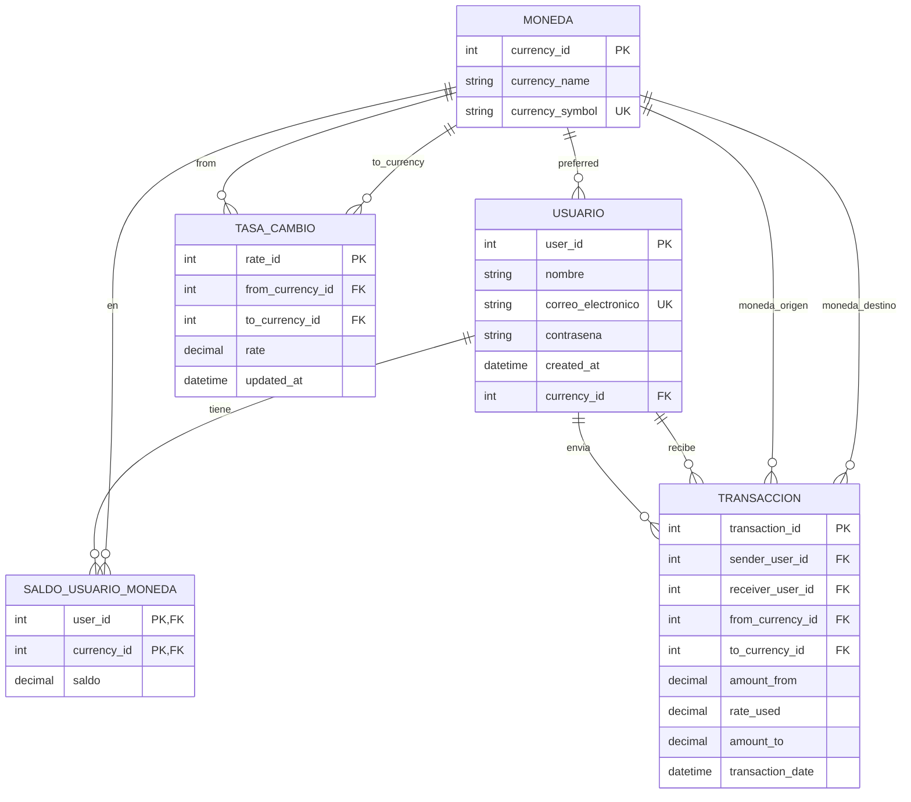

# AlkeWallet (MySQL 8) — Evaluación Módulo 3

Repositorio de entrega que implementa una base de datos relacional para una billetera virtual (**AlkeWallet**) en **MySQL 8 / InnoDB**, con soporte multimoneda, tasas de cambio y transferencias transaccionales.

El comportamiento central del modelo es: **la moneda destino de una transferencia siempre es la moneda preferida del receptor** (aunque el emisor envíe en otra moneda).

---

## Alcance y premisas

- Cada usuario define una **moneda preferida** (`usuario.currency_id`).
- El saldo se administra por **usuario y moneda** (`saldo_usuario_moneda`) para soportar multimoneda real.
- Las conversiones se calculan mediante **tasas de cambio** `from_currency_id -> to_currency_id` (`tasa_cambio`).
- Toda transferencia se audita en `transaccion`, registrando montos y tasa usada (`rate_used`, `amount_to`).

---

## Estructura del repositorio

- `alkewallet.sql` (o `AlkeWallet.sql`): script principal con DDL, DML y objetos SQL (función/trigger/procedure/vista).
- `README.md`: documentación de la solución (este archivo).
- Evidencias (capturas): se agregan aparte para la entrega (creación de BD, `DESCRIBE`, consultas, ejecución de transferencias, etc.).

---

## Modelo de datos

### Tablas

- `moneda`: catálogo de monedas (`currency_symbol` único).
- `usuario`: usuarios del sistema, incluye su moneda preferida (`currency_id`).
- `saldo_usuario_moneda`: saldos por (usuario, moneda), con PK compuesta `(user_id, currency_id)`.
- `tasa_cambio`: tasas de conversión por par `(from_currency_id, to_currency_id)` con restricción única.
- `transaccion`: registro de transferencias, guardando moneda origen/destino, tasa usada y montos.

### Diagrama entidad–relación (Mermaid)

> Nota: en GitHub, evita usar la palabra `to` como etiqueta de relación en Mermaid ERD; por eso se usa `to_currency`.

---

## Lógica implementada (en el SQL)

El script incorpora lógica para asegurar que la premisa de moneda destino se cumpla de forma consistente:

- **Función `fx_rate(p_from, p_to)`**: consulta `tasa_cambio` y devuelve la tasa vigente del par (from -> to).
- **Trigger `bi_transaccion_enforce_calc` (BEFORE INSERT en `transaccion`)**:
  - Forza `NEW.to_currency_id` a la moneda preferida del receptor.
  - Calcula `NEW.rate_used` y `NEW.amount_to` usando `fx_rate`.
- **Procedure `sp_transfer(...)`**:
  - Ejecuta la transferencia con control transaccional (START TRANSACTION / COMMIT).
  - Valida saldo suficiente del emisor en moneda origen.
  - Acredita al receptor en su moneda preferida y registra la transacción.
- **Vista `vw_top5_saldo_clp`**:
  - Ranking top‑5 por saldo equivalente en CLP (conversión usando `fx_rate`).

---

## Ejecución (DBeaver / MySQL 8)

### Requisitos
- MySQL 8.x
- DBeaver (u otro cliente SQL)

### Cómo ejecutar
1. Abrir el archivo `alkewallet.sql` en DBeaver.
2. Ejecutar como **SQL Script** (no como “Execute statement”), porque el archivo utiliza `DELIMITER $$` para crear función, trigger y procedure.

### Comandos útiles para evidencias
Estos comandos están incluidos al final del script (o son consistentes con él) y sirven para capturas:

- `SHOW DATABASES;`
- `SHOW TABLES;`
- `DESCRIBE usuario;` (y otras tablas)
- `SHOW CREATE TABLE usuario;`
- `SHOW CREATE TABLE transaccion;`

### Nota: Error 1419 (binary logging)
Si al crear la función aparece el error **1419** (“binary logging is enabled…”), el servidor MySQL requiere habilitar `log_bin_trust_function_creators` con un usuario administrador y re-ejecutar el bloque de creación de rutinas.

---

## Pruebas incluidas en el script

El script contiene transacciones de ejemplo ejecutando `CALL sp_transfer(...)` para validar:
- Descuento de saldo al emisor en moneda origen.
- Conversión a moneda preferida del receptor.
- Registro en `transaccion` con tasa usada (`rate_used`) y monto destino (`amount_to`).

---

## Consultas incluidas (resumen)

Incluye consultas para:
- Listar usuarios y filtrar por `WHERE`.
- Obtener moneda preferida via `JOIN` entre `usuario` y `moneda`.
- Listar transacciones con joins múltiples (emisor, receptor, moneda origen y destino).
- Agregaciones (`COUNT`) y subconsulta de participaciones.
- Vista de ranking `vw_top5_saldo_clp`.

---

## Resultados esperados

- La moneda destino en `transaccion.to_currency_id` coincide con la moneda preferida del receptor.
- `sp_transfer` aplica conversión y deja auditoría de la tasa en `rate_used`.
- La vista `vw_top5_saldo_clp` permite comparar saldos de usuarios en una moneda común (CLP equivalente).

---

## Autor
Carlo Javier González Rojas
